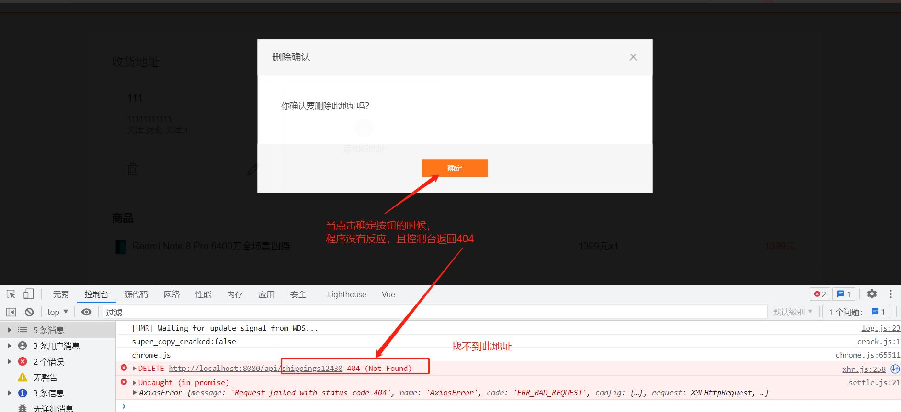
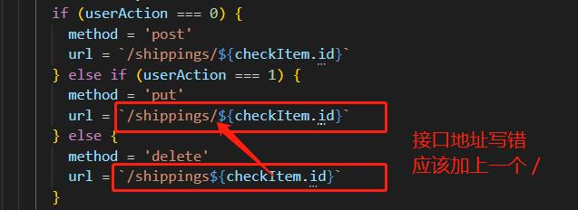
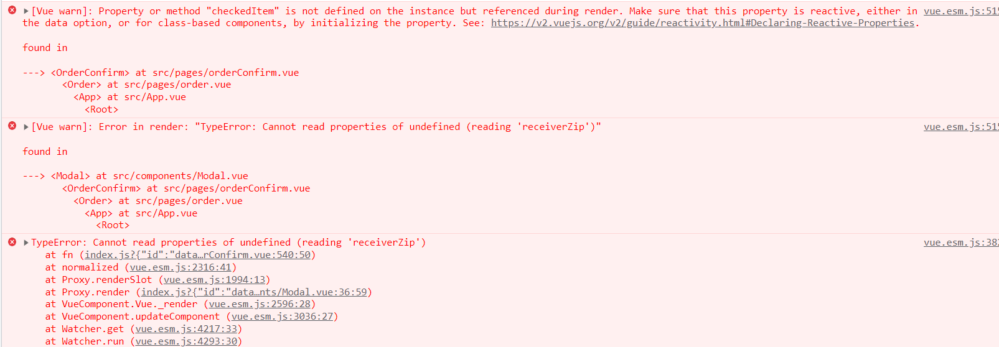
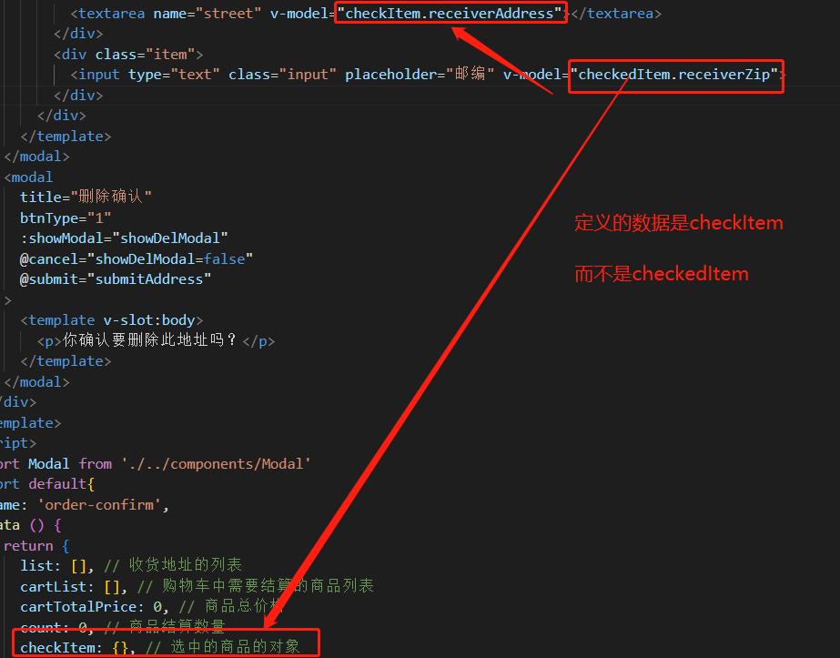
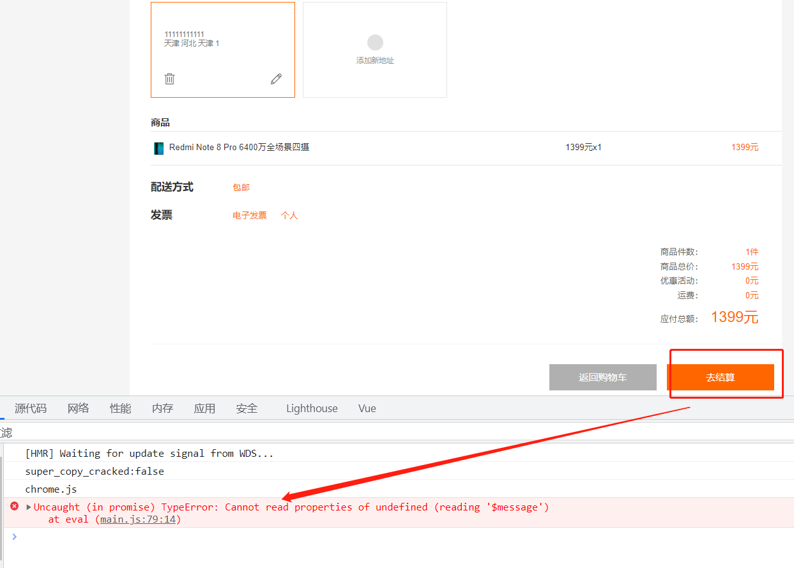
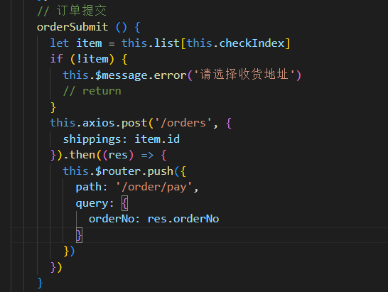
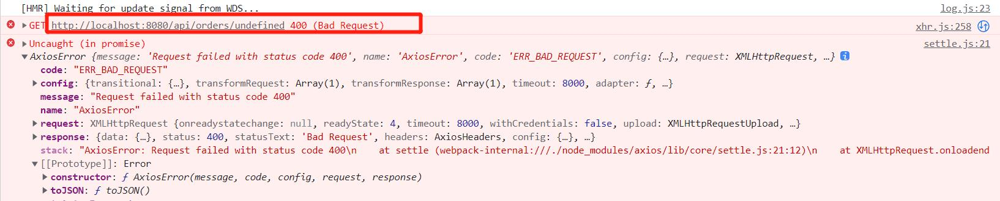
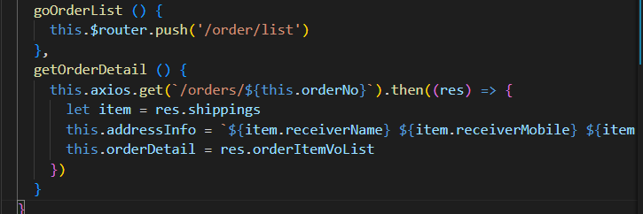

# 遇到的问题

- 在运行项目的时候，控制台提示：**Syntax Error: Unexpected token (25:4)**

```js

  23 |   },
  24 |   computed: {
> 25 |     ...mapState(['username'])
     |     ^
  26 |   }
  27 | }
  28 |
```

原因：webpack无法解析 ...（三点运算符），它是ES6的新特性。昨天可能是前面配置Babel的时候，将.babelrc文件删除了的原因。

解决方法：

重新配置.babelrc文件，如下：

```json
{
  "presets": [
    "stage-2"
  ]
}
```


- 在写v-bind指令的时候，因为手快，写成了v-bing。然后控制台提示：

[Vue warn]: Failed to resolve directive: bing   指令解析失败：bing

解决方法：将v-bing改为 v-bind


- 接口地址写错，控制台报错提示：地址找不到404，如下图



解决方法：修改为正确的接口地址即可


由于使用了没定义的数据，造成浏览器无法解析，如下图：



解决方法：将数据修改成定义好的数据即可



在实现提交订单功能的时候，控制台提示：**TypeError: Cannot read properties of undefined (reading '$message')     at eval**，无法在 eval 读取未定义的属性(读取“ $message”)






​	（10月25日未解决）


不知道哪里出错了，感觉接口地址也有写错，请求方式也没错，但是控制台提示的信息是：错误请求，如下图：





（10月25日未解决）


# 今日小结

1、主要学习了退出功能的实现，以及cookie的识别、项目性能的优化

2、解决了昨天的bug


原因：无法识别Vuex这个插件

解决方法：
将其中的Vuex改成vuex

# 明日计划

